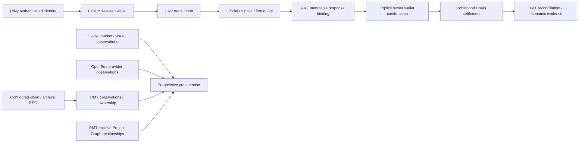

# RMT service authority map — 2026-09-30

Audited source: `41cbc27029dfffad07ee71e97c3052d9d5d0cabb`. Public product identity: **Robinhood Chain, chainId 4663**. This map records the current provider-native execution boundary and the intended responsibility boundaries for unreleased product phases. It does not activate those phases or switch RPC providers.

See [the infrastructure preflight](RMT_INFRASTRUCTURE_PREFLIGHT_2026_09_30.md) for source calls, live read-only evidence, limits, deployment scopes and cost assumptions. `CURRENT`, `CANDIDATE` and `PLANNED` are deliberately distinct.

## One primary owner per responsibility

| Responsibility | PRIMARY | Status and scope | Explicitly secondary / not authority |
| --- | --- | --- | --- |
| Authentication | Privy | CURRENT: server verifies the configured app's authenticated identity and linked wallet. | RMT renders session/recovery state; a balance or connected address is not authentication. |
| Wallet authority | The user's explicitly selected wallet through the existing Privy/external-wallet controller | CURRENT: exact account, provider/connector and chain continuity; embedded and external wallets remain supported. | Wallet discovery is not signer selection. Funding connectors cannot replace the selected trading wallet. |
| Chain RPC | The existing service-configured Robinhood Chain JSON-RPC endpoint | CURRENT: web defaults to Robinhood's public endpoint where no override is configured; Railway URLs are secret-bearing and were not readable in this audit. | Alchemy is a CANDIDATE, not the production authority chosen by this PR. Explorer/provider market labels are not chain state. |
| Archive RPC | Existing `RMT_ARCHIVE_RPC_URL` for the main indexer | CURRENT: historical deployment-state evidence; fallback to `RMT_RPC_URL` is explicitly secondary and must actually support the requested history. | Alchemy archive is a CANDIDATE pending same-block equivalence and account-plan tests. Historical logs/receipts alone do not prove historical state support. |
| Spot execution | 0x Swap API v2 AllowanceHolder | CURRENT: official server-side HTTPS price/quote, provider transaction construction and routing. | RMT binds intent/authentication/terms and immutable handoff. It does not re-prove route internals, bytecode registries or simulate a second swap. Gasless and direct legacy executors are not fallback execution. |
| Charts / OHLCV | GeckoTerminal | CURRENT: exact token/pool, provider observations, bounded contract-based pool discovery and OHLCV. | RMT caches/presents last-known evidence and unavailable states; it never invents candles. No new chart provider. |
| Token market presentation | GeckoTerminal / CoinGecko onchain market evidence | CURRENT: provider price, pools, liquidity, volume and optional visual metadata. | RMT market indexer and existing venue reads corroborate market relationships. Market data is not execution permission or project curation. Existing DEX Screener use is not expanded. |
| NFT marketplace evidence | OpenSea | CURRENT CODE / NOT ACTIVATED here: provider listings, reported floor, sales and provider volume. | RMT stores scoped provenance/cursors/observations. Onchain transfers are not sales, and provider listings are not executable orders. |
| NFT ownership | RMT's durable NFT ownership projection | CURRENT: canonical source verification, persisted events/checkpoints and completeness-aware ownership. | Alchemy holdings/NFT APIs may assist discovery or observation later; they cannot replace participating-project economic authority. |
| Project Graph | RMT project identity / relationship model | CURRENT FOUNDATION: exact contracts and positive relationship evidence, including `OWNER_CONFIRMED_PROJECT_TOKEN`. | Names/symbols, provider imagery and proposed PEEPS/CANNACAT/HOPIUM pairings do not establish membership. Membership is presentation authority only. |
| Portfolio observation | Configured Robinhood Chain RPC | CURRENT: exact-wallet balances/receipts; future transfer/address APIs may accelerate observations. | Alchemy Transfers/Address Activity are CANDIDATES; provider delivery is not deterministic cost basis or final economic eligibility. |
| Portfolio economic authority | RMT's reconciled onchain settlement and accounting evidence | CURRENT RECOVERY FOUNDATION / PLANNED richer accounting: bind originating sender, transaction, receipt, asset movement and provenance. | Privy holdings, quote amounts, 0x estimated USD values and external portfolio summaries cannot invent fills, cost basis or P&L. Missing history remains unavailable. |
| Proof of Holding | RMT deterministic ownership / eligibility evidence | PLANNED: block-qualified ownership, checkpoints, reorg policy and project-specific rules. | Generic balance/NFT/Transfers APIs can accelerate collection, not adjudicate economic entitlement. No feature activation in this PR. |
| Revenue accounting | RMT economic ledger | CURRENT FOUNDATION / PLANNED broader accounting: independently reconcile actual settled fees/revenue. | 0x Trade Analytics can provide attributable transaction reports; it is not final onchain economic authority. No fee changes here. |
| Distribution | RMT reviewed distribution rules and settlement ledger | RELEASE-LOCKED / PLANNED: explicit project economics and deterministic entitlement. | A webhook, wallet provider or multiple 0x fee recipient capability is not automatic distribution authorization. |
| Web hosting | Existing Vercel RMT project | CURRENT: public UI, bounded server readers, CDN and framework caching. | Persistent ingestion does not belong in browser timers or request-scoped Vercel jobs. Existing ignored-build guard, plan and budget controls remain intact. |
| Persistent workers | Existing Railway application services | CURRENT: main, market and NFT workers with durable checkpoints; marketplace source code exists but activation is separate. | Vercel serves reads, not a competing ownership indexer. No new service or replica is provisioned. |
| Durable databases | Existing dedicated Railway PostgreSQL databases | CURRENT: each indexer retains its own isolated database and credentials. | Process-local maps and caches are accelerators, not durable authority. No sharing/reset/migration/provisioning is performed here. |

The archive and current-chain rows designate one configured endpoint per workload, not a second network. Arbitrum Nitro is infrastructure knowledge; **Arbitrum One is not an RMT execution network**.

## Non-circular data flow

There is intentionally no arrow from chart/artwork/Project Graph/provider market enrichment to trade permission. Chain observations support units, balances and settlement where actually needed, not a new mandatory route re-proof.

## Execution contract retained

The public path remains official 0x Swap API v2 AllowanceHolder on 4663. Gasless dispatch is zero. RMT preserves authenticated selected signer/taker/recipient, exact assets and atomic amount, provider terms and original transaction fields, exact AllowanceHolder approval when required, fresh post-approval quote, immutable HMAC-bound handoff, expiry, cancellation/generation isolation, duplicate protection and originating-wallet recovery. Stock Tokens remain view-only under positive-deny authority.

The **existing 25-bps fee selector and treasury remain unchanged**: base/base uses input; otherwise either leg USDG selects USDG; otherwise either leg native ETH selects native ETH; otherwise sell asset. Token→ETH/USDG may collect fees in output units. WETH is distinct from native ETH. This map does not activate multiple recipients or change economics.

Historical documents/tests describing strict route decoding, per-trade runtime proof, independent swap simulation or universal sell-token fees must not be treated as permission to restore superseded public-swap restrictions. Their historical evidence remains intact. Consult the current public route and provider-native implementation when interpreting them.

## Product laws for subsequent work

- Mobile: fast, minimal, visual and stable; find → understand → trade; immediate Buy/Sell; technical information progressively disclosed.
- Desktop: information-rich cockpit, persistent ticket, large stable chart, market navigator and deeper activity/project/ownership evidence.
- Enrichment updates data without moving controls, scrolling, remounting the composer, changing wallet/payment asset/amount, or reordering a row under active interaction.
- Missing artwork uses an intentional fallback; missing chart/metadata/holders/socials/Project Graph stays unavailable, never fabricated and never an ordinary-swap gate.
- Infrastructure/provider failure must not silently mutate trade intent. Unknown output units retain truthful base-unit presentation; unknown input units are not invented.
- Project Graph, Token↔NFT economies, Portfolio, Proof of Holding, CCFF00 benefits, Distribution, RMT Passport, project competitions and agents are RMT's future distinct layer. Infrastructure should serve that product, not turn it into a generic green DEX dashboard.

## Changes and release boundary

This PR changes repository watch patterns, a watch-scope regression test and its existing CI step, plus audit documentation/evidence. It changes no application runtime, shared runtime package, trading handler, database, environment variable, service identity, region, replica or resource limit. No deployment, merge, RPC switch, marketplace activation or financial action is authorized by this implementation.

The two NFT services currently use dashboard-inline scopes; repository changes do **not** prove those live scopes changed. Adopting the reviewed repository scopes there requires a later authorized configuration action. The main and market services already reference their repository `railway.json` files.
